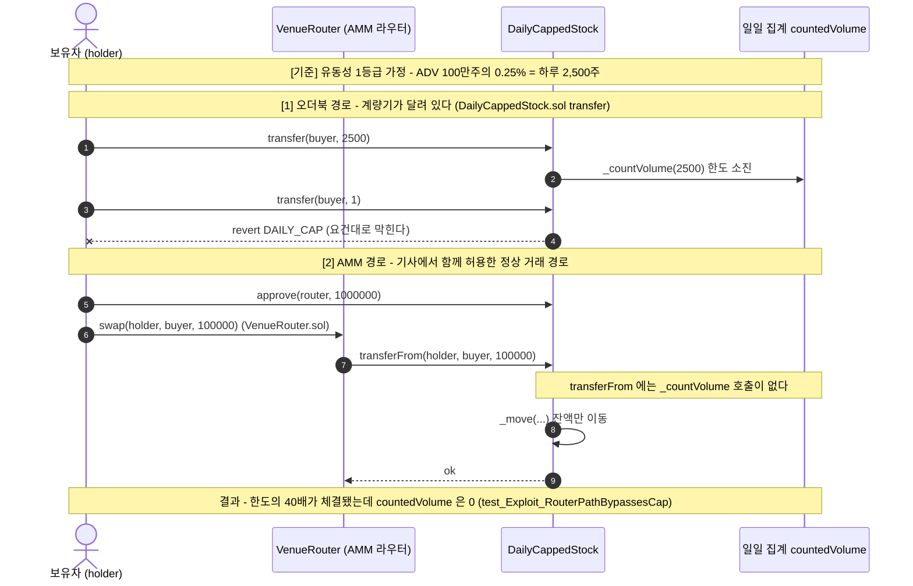
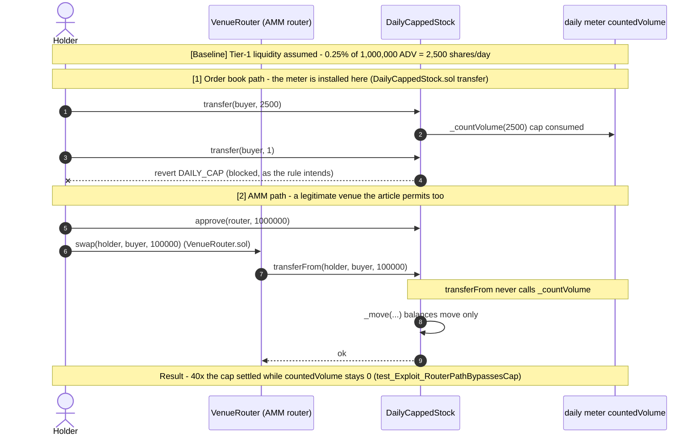

# SEC 토큰화 주식 '혁신 면제' 요건을 컨트랙트로 옮겨보기


2026년 9월 17일, 미국 SEC가 토큰화 주식 거래에 **5년간 한시적인 '혁신 면제'** 를 승인했다는 기사를 읽고 시작한 학습용 저장소입니다. 기사에는 TSV(토큰화증권 거래 플랫폼)가 지켜야 할 조건이 문장으로 나열돼 있는데, **그 문장을 Solidity로 옮기면 어디서 어긋나는지** 를 직접 확인해보고 싶었습니다. 조건 네 개(일일 거래량 한도 · 거래정지 연계 · 발행사 거부권 · 권리 승계)를 골라 각각 **`요건을 순진하게 옮긴 버전` ↔ `고친 버전`** 한 쌍으로 만들고, 요건이 실제로 깨지는 것과 수정본에서 막히는 것을 Foundry 테스트 13개로 확인했습니다.

> ⚠️ 이 저장소는 **규제 문장을 코드로 옮겨보며 이해하려는 학습용**입니다. SEC 원문 규정을 읽고 구현한 것이 아니라 [ZDNet 기사](https://zdnet.co.kr/view/?no=20260918082351)로 보도된 조건만을 근거로 했고, 실제 상품(로빈후드 Stock Tokens, 크라켄 xStocks 등)을 분석하거나 규정 준수 여부를 판단한 것이 아닙니다. 어떤 코드도 프로덕션용이 아닙니다.

---

## 프로젝트 핵심 요소

1. **규제 문장 한 줄을 온체인 제약으로 옮기고, 어긋나는 지점을 찾기**
   - 기사의 조건("ADV의 0.25%까지", "원주식 정지 시 토큰도 정지", "30일 전 통지 후 반대하면 불가", "배당권·의결권 등 동일한 권리 보장")을 각각 최소 컨트랙트로 구현
   - 네 경우 모두 **검사 코드 자체는 존재하고, 정상 경로에서는 정확히 동작한다** — 그래서 평소 테스트로는 문제가 드러나지 않는다
   - 요건별로 기사 원문 인용을 NatSpec 주석에 남겨, 어떤 문장을 어떻게 해석했는지 추적 가능하게 함

2. **요건이 깨지는 것과 막히는 것을 테스트로 증명 (13 tests, 전부 통과)**
   - 요건마다 `test_Exploit_*`(요건이 실제로 깨짐), `test_Fix_*`(수정본에서 막힘), 그리고 **`test_Cap_*`·`test_Halt_*`·`test_Veto_*`·`test_Dividend_*` 기준선**(정상 경로에선 잘 동작함)을 함께 작성
   - 예: AMM 라우터 경로로 하루 한도 2,500주의 **40배인 10만 주**가 체결되는데 `countedVolume` 은 **0** 인 것을 단언으로 확인
   - 발행사가 분명히 반대했는데도 **재통지 한 번으로 30일 뒤 상장**되는 것을 상태 변화로 확인
   - 배당 선언 **이후에** 매수한 주소가 배당을 가져가고, 선언 시점 보유자의 청구가 `NO_SHARE` 로 되돌려지는 것을 확인

3. **내 수정본의 한계까지 테스트로 남기기**
   - 수정본은 집계를 일 단위(`block.timestamp / 1 days`)로 끊는데, **자정 경계에서 2초 만에 한도의 2배**가 처리된다
   - 이걸 `test_Limit_DayBoundaryAllowsDoubleCap` 으로 박아두어, "고쳤다"가 아니라 "여기까지 고쳤고 여기부터는 모른다"를 기록
   - 남은 질문(ADV 값 자체의 오라클 의존, 롤링 윈도우 비용, 플랫폼당 75종목 제한)은 [`docs/tsv-requirements-mapping.md`](docs/tsv-requirements-mapping.md) 에 정리

---

## 시스템 아키텍처 & 라이프사이클 흐름

가장 배울 게 많았던 **01. 일일 거래량 한도** 의 흐름입니다. 기사에서 TSV는 **오더북과 AMM 유동성 풀을 모두** 쓸 수 있다고 했는데, 토큰 입장에서 이 둘은 서로 다른 함수로 들어옵니다. 한도 계량기를 한쪽에만 달면 다른 쪽으로 그대로 새어나갑니다.



**한 줄 요약:** 규제 문장은 "평균 일일 거래량의 0.25%"라는 **숫자**를 말하지만, 컨트랙트에서 실제로 결정하는 것은 **그 거래량을 어디서 세느냐** 였다. 수정은 `_countVolume` 호출을 `transfer` 에서 잔액이 움직이는 `_move` 안으로 옮긴 것 하나뿐이다.

---

## 요건 4종 & 확인한 것

| # | 기사 속 요건 | 구현 파일 | 깨지는 것을 보인 테스트 | 어긋난 지점 |
|---|---|---|---|---|
| 01 | 유동성 1등급은 ADV의 0.25%까지 | `01-daily-cap/` | `test_Exploit_RouterPathBypassesCap` | 집계가 **경로 하나에만** 걸림 |
| 02 | 원주식 정지 시 토큰도 정지 | `02-halt-link/` | `test_Exploit_TradesWhileOracleIsStale` | 외부 값이 **없을 때의 기본값**이 위험한 쪽 |
| 03 | 30일 전 통지, 반대 시 거래 불가 | `03-issuer-veto/` | `test_Exploit_RenotifyResetsVeto` | 거부가 **저장되지 않고 휘발** |
| 04 | 배당권·의결권 등 원주식과 동일한 권리 | `04-rights-passthrough/` | `test_Exploit_BuyAfterDeclarationTakesDividend` | 권리 자격이 **기준일이 아닌 현재 잔고**에 붙음 |

### 01 — 한도는 "얼마"가 아니라 "어디서 세느냐"
`transfer` 에만 한도를 걸어도 `test_Cap_WorksOnOrderbookPath` 는 통과한다. 2,500주에서 정확히 `DAILY_CAP` 으로 막히기 때문이다. **이 테스트가 통과하는 것이 오히려 버그를 가린다.** 같은 토큰을 AMM 라우터(`transferFrom`)로 거래하면 10만 주가 체결되고 계량기는 0을 가리킨다.

22회차 보안 과정에서 본 cross-function 재진입과 같은 모양이었다. 거기서는 **가드가** 진입점 하나에만 걸려 있었고, 여기서는 **계량기가** 진입점 하나에만 달려 있다. 진입점이 여러 개인 상태를 건드릴 때는 검사를 진입점이 아니라 공통 경로에 두어야 한다는 게 같은 교훈이다.

### 02 — "정지면 멈춘다"와 "정지가 아님을 확인했을 때만 거래한다"는 다르다
`require(!oracle.halted())` 는 기사 문장을 그대로 옮긴 것처럼 보인다. 그런데 이 코드는 오라클이 **침묵하는 동안 거래를 허용**한다. 리포터가 멈춘 3일 동안 원주식이 정지됐더라도 토큰은 계속 거래된다. 갱신 시각(`updatedAt`)을 함께 확인해 오래됐으면 스스로 멈추면(fail-closed), 오라클 장애가 규제 위반이 아니라 거래 중단으로 이어진다.

이건 제가 설계 중인 K-Gold의 PoR 오라클에도 그대로 걸리는 질문이었다 — 담보 잔고를 확인하지 못하는 동안 발행을 계속할 것인가, 멈출 것인가.

### 03 — 30일은 시간 조건처럼 보이지만 실제로는 저장 조건
발행사 거부권은 기사에서 "핵심적인 투자자 보호 장치"로 평가된 조항이다. 그런데 반대를 "이번 통지의 취소"로 처리하면, 플랫폼이 다음 날 재통지할 때마다 30일 시계가 새로 돈다. 발행사가 **매번 지켜보고 매번 반대해야** 하므로, 거부권이 아니라 30일짜리 지연권이 된다. 기간 계산을 아무리 정확히 구현해도 거부가 휘발성이면 조항의 의도가 남지 않았다.

### 04 — 권리를 "붙였는가"가 아니라 "어느 시점 명부로 나누는가"
기사에서 이 조항은 가격만 추종하는 기존 상품(로빈후드 `Stock Tokens`, 크라켄 `xStocks`)이 면제를 쓰려면 재설계가 필요할 수 있다고 지목된 부분이다. 그래서 처음엔 "배당 함수를 넣으면 되는 것 아닌가" 로 시작했다. 넣었고, 지분대로 정확히 나뉘고(`test_Dividend_SplitsByShare`), 중복 수령을 막는 `claimed` 매핑까지 뒀다.

그런데 실제 주식의 배당은 **기준일(record date)에 주주명부에 있던 사람**에게 간다. 순진한 버전은 **청구하는 순간의 잔고**로 나눈다. 그래서 배당 선언 뒤에 산 주소가 배당을 가져가고, 선언 시점에 들고 있던 보유자는 지분이 0이라 `NO_SHARE` 로 막힌다. **배당 총액 10 이더는 한 푼도 틀리지 않는데, 받는 사람이 바뀐다.** `claimed` 도 주소만 보므로, 받은 뒤 토큰을 새 주소로 넘기면 그 주소는 "아직 받은 적 없는 주소"다.

수정본은 토큰이 움직이기 직전에 양쪽의 이동 전 잔고를 회차별로 기록해(`_record`) 기준일 명부를 만든다. 한 번도 움직이지 않은 주소는 기록이 없으므로 현재 잔고가 곧 기준일 잔고라, 보유자 전체를 순회하지 않아도 된다. 의결권도 같은 모양이다 — 투표한 뒤 토큰을 넘기면 받은 주소가 다시 투표할 수 있어 이중 집계가 된다. 같은 원인이라 코드로 반복하지는 않았다.

### 그리고 — 내 수정본도 완전하지 않다
`test_Limit_DayBoundaryAllowsDoubleCap` 은 **수정본이 여전히 뚫리는** 경우를 보여준다. 집계를 일 단위로 끊었기 때문에, 자정 1초 전에 2,500주 + 1초 후에 2,500주를 체결하면 **2초 안에 5,000주** 가 처리된다. "평균 일일 거래량의 0.25%"라는 문장을 정말로 지키려면 롤링 윈도우가 필요해 보이는데, 가스 비용과 어떻게 맞추는지는 아직 모르겠다. 고친 것과 못 고친 것을 나눠 기록해두는 편이 정직하다고 생각해 테스트로 남겼다.

---

## 기술 스택

| 구분 | 사용 기술 |
|---|---|
| **언어 / 컴파일러** | Solidity `0.8.25` (`foundry.toml` 에 고정) |
| **개발 · 테스트 프레임워크** | Foundry `1.8.1` (forge test, cheatcodes: `vm.prank`, `vm.warp`, `vm.expectRevert`) |
| **테스트 라이브러리** | forge-std `v1.16.2` |
| **환경** | macOS (Apple Silicon) |
| **참고 자료** | [ZDNet Korea 2026-09-18 기사](https://zdnet.co.kr/view/?no=20260918082351) — SEC 혁신 면제 / TSV 조건 |

---

## 트러블슈팅 및 환경 최적화

> **테스트 단언 메시지에 한글을 쓰자 컴파일 실패**
> - **문제 상황:** 단언 메시지를 한글로 쓰고 빌드하니 `Error (8936): Invalid character in string. If you are trying to use Unicode characters, use a unicode"..." string literal.` 로 컴파일이 멈췄다.
> - **원인 분석:** Solidity의 일반 문자열 리터럴은 ASCII만 허용한다. 한글처럼 ASCII 밖의 문자를 넣으려면 `unicode"..."` 리터럴을 따로 써야 한다.
> - **해결 방안:** 설명이 필요한 맥락은 **주석(한글)** 에 두고, **단언 메시지는 영어**로 통일했다. `unicode"..."` 로 우회할 수도 있지만, 실패 로그가 터미널 환경에 따라 깨질 수 있어 기존 저장소(22회차)와 같은 방식을 유지했다.

> **`forge build` 의 missing-inheritance 린트 — 고치지 않기로 한 판단**
> - **문제 상황:** 빌드할 때마다 `note[missing-inheritance]: contract DailyCappedStock implements interface IStock's external API but does not explicitly inherit from it` 가 떴다.
> - **원인 분석:** 라우터가 쓰는 `IStock` 인터페이스의 외부 API를 토큰이 그대로 구현하고 있으니 상속하라는 제안이다. 오류가 아니라 note 단계의 린트다.
> - **해결 방안:** 상속하지 않고 그대로 두었다. `IStock` 은 **라우터가 필요로 하는 함수만** 추려낸 것이고, 토큰 쪽은 ERC-20 전체가 아니라 한도 실험에 필요한 부분만 가진 최소 예제다. 여기서 상속을 넣으면 "이 토큰은 IStock 규격을 따른다"는, 실험 범위를 넘는 주장이 된다고 판단했다. 린트가 틀렸다기보다, 이 저장소의 목적과 맞지 않아 받아들이지 않은 경우다.

---

## 실행 가이드 (Quick Start)

### 사전 조건 (Prerequisites)
- [Foundry](https://book.getfoundry.sh/) (`forge` 1.8.x)

### 1) 저장소 받기 & 빌드
```bash
git clone https://github.com/Andrewpark-hub/sec-tsv-tokenized-stock-lab.git
cd sec-tsv-tokenized-stock-lab
forge build            # solc 0.8.25 자동 사용
```

### 2) 테스트 (13개 전부 통과)
```bash
forge test -vv
```

### 3) 요건 하나만 따라가며 보기
```bash
forge test --match-path test/01_DailyCap.t.sol -vvv   # 일일 거래량 한도
forge test --match-path test/02_HaltLink.t.sol  -vvv  # 거래정지 연계
forge test --match-path test/03_IssuerVeto.t.sol -vvv # 발행사 거부권
forge test --match-path test/04_RightsPassthrough.t.sol -vvv # 권리 승계
```

---

## 저장소 구조

```
src/
  01-daily-cap/     DailyCappedStock.sol       <-> DailyCappedStockFixed.sol
                    VenueRouter.sol             (AMM 라우터 흉내 - 공격자가 아니라 정상 경로)
  02-halt-link/     HaltLinkedStock.sol        <-> HaltLinkedStockFixed.sol
                    MarketHaltOracle.sol        (원주식 거래정지 오라클)
  03-issuer-veto/   TokenizationRegistry.sol   <-> TokenizationRegistryFixed.sol
  04-rights-passthrough/
                    RightsPassthroughStock.sol <-> RightsPassthroughStockFixed.sol
test/
  01_DailyCap.t.sol   02_HaltLink.t.sol   03_IssuerVeto.t.sol   04_RightsPassthrough.t.sol
docs/
  tsv-requirements-mapping.md   기사 속 요건 전체 정리 + 구현/미구현 구분 + 남은 질문
```

---

## 배운 것 & 다음

- 규제 문장은 대부분 **숫자와 기간**으로 쓰여 있는데, 실제로 구현을 좌우한 것은 **어디서 세느냐 · 모를 때 어느 쪽으로 넘어지느냐 · 어디에 저장하느냐** 였다. 네 경우 모두 숫자는 정확히 맞췄는데도 요건이 깨졌다. 04에서는 배당 총액이 1 wei도 틀리지 않은 채로 권리만 엉뚱한 주소로 갔다.
- 22회차에서 배운 "가드는 진입점마다, 그리고 공유 상태를 건드리는 모든 경로에" 가 보안 취약점뿐 아니라 **규제 요건 구현에도 똑같이 적용**된다는 것을 확인했다. 컴플라이언스 로직도 결국 회계 불변식 문제였다.
- 설계 중인 RWA 정산 아이디어(K-Gold)의 **Circuit Breaker** 는 이 저장소의 `01-daily-cap` 과 사실상 같은 구조다(유통량 상한을 온체인에서 강제). 다음으로는 여기서 확인한 두 가지 — 집계 지점을 공통 경로에 두는 것, 그리고 일 단위 경계 문제 — 를 반영해 K-Gold의 Circuit Breaker를 구현해볼 계획이다.
- 미구현으로 남긴 요건(제3자 수탁, 레버리지 배제)과 아직 답을 모르는 질문들은 `docs/` 에 그대로 적어두었다.

---

*이 저장소의 취약 코드는 학습 목적의 의도된 결함을 포함합니다. 어떤 코드도 프로덕션에 사용하지 마세요. 또한 이 저장소는 법률·규제 자문이 아닙니다.*

---
---

# Translating the SEC's Tokenized-Stock "Innovation Exemption" Requirements into Contracts

*English version — the Korean original is above.*


This learning repository started from a news article on 17 September 2026: the U.S. SEC approved a **temporary, five-year "Innovation Exemption"** for trading tokenized stocks. The article lists, in prose, the conditions a TSV (Tokenized Securities Venue) has to meet — and I wanted to see for myself **where those sentences start to break once you write them in Solidity**. I picked four conditions (daily volume cap, trading-halt linkage, issuer veto, rights pass-through), built each as a pair of **`a naive translation of the requirement` ↔ `a fixed version`**, and used 13 Foundry tests to confirm both that the requirement really breaks and that the fix holds.

> ⚠️ This repository is **a learning exercise in translating regulatory prose into code**. It is not built from the SEC's primary text; it relies only on the conditions as reported in [this ZDNet article](https://zdnet.co.kr/view/?no=20260918082351). It does not analyze real products (Robinhood Stock Tokens, Kraken xStocks, etc.) or judge anyone's compliance. None of this code is meant for production.

---

## Key Components

1. **Translating one line of regulation into an on-chain constraint, then finding where it slips**
   - Each condition from the article ("up to 0.25% of ADV", "halt the token when the underlying halts", "30 days' notice, blocked if the issuer objects", "the same rights as the underlying share, including dividends and voting") implemented as a minimal contract
   - In all four cases **the check itself exists and works correctly on the normal path** — which is exactly why ordinary tests do not reveal the problem
   - The quoted source sentence is kept in the NatSpec of each contract, so you can trace which sentence was interpreted how

2. **Proving both the break and the fix with tests (13 tests, all passing)**
   - Every requirement gets a `test_Exploit_*` (the requirement really breaks), a `test_Fix_*` (the fixed version blocks it), and a **baseline** (`test_Cap_*` / `test_Halt_*` / `test_Veto_*` / `test_Dividend_*`) showing it works fine on the normal path
   - For example: through the AMM router path, **100,000 shares — 40x the 2,500-share daily cap — settle while `countedVolume` reads 0**
   - And: after the issuer clearly objected, **a single re-notification lists the stock 30 days later**, asserted through state changes
   - And: an address that buys **after** the dividend is declared collects it, while the holder at declaration time has their claim reverted with `NO_SHARE`

3. **Recording the limits of my own fix, also as a test**
   - My fix buckets volume per day (`block.timestamp / 1 days`), so at the midnight boundary **twice the cap settles within 2 seconds**
   - `test_Limit_DayBoundaryAllowsDoubleCap` pins this down, so the repo says "fixed this far, and beyond here I don't know" rather than "fixed"
   - Open questions (the ADV figure's own oracle dependence, the cost of a rolling window, the per-platform 75-symbol limit) are written up in [`docs/tsv-requirements-mapping.md`](docs/tsv-requirements-mapping.md)

---

## System Architecture & Lifecycle Flow

Here is **01. the daily volume cap**, the case I learned the most from. The article says a TSV may use **both an order book and AMM liquidity pools** — but from the token's point of view those two arrive through different functions. Put the meter on only one of them and the volume simply leaks out the other.



**In one line:** the regulation states a **number** — "0.25% of average daily volume" — but what actually decided the outcome in the contract was **where that volume gets counted**. The fix is a single move: calling `_countVolume` from inside `_move`, where balances actually change, instead of from `transfer`.

---

## The 4 Requirements & What I Found

| # | Requirement (from the article) | Files | Test showing it breaks | Where it slipped |
|---|---|---|---|---|
| 01 | Tier-1 liquidity: up to 0.25% of ADV | `01-daily-cap/` | `test_Exploit_RouterPathBypassesCap` | counting attached to **one path only** |
| 02 | Token halts when the underlying halts | `02-halt-link/` | `test_Exploit_TradesWhileOracleIsStale` | the **default when the oracle is silent** fails open |
| 03 | 30 days' notice; blocked if the issuer objects | `03-issuer-veto/` | `test_Exploit_RenotifyResetsVeto` | the veto is **never stored** |
| 04 | Same rights as the underlying share (dividends, voting) | `04-rights-passthrough/` | `test_Exploit_BuyAfterDeclarationTakesDividend` | entitlement attached to the **current balance, not a record date** |

### 01 — A cap is not about "how much" but "where you count"
Even with the cap only on `transfer`, `test_Cap_WorksOnOrderbookPath` passes: it reverts with `DAILY_CAP` at exactly 2,500 shares. **That passing test is what hides the bug.** Trade the same token through an AMM router (`transferFrom`) and 100,000 shares settle while the meter reads zero.

It turned out to be the same shape as the cross-function reentrancy I saw in the 22nd session's security track. There, the **guard** was on a single entry point; here, the **meter** is. The shared lesson: when several entry points touch the same state, the check belongs on the common path, not on the entry points.

### 02 — "Stop when halted" is not the same as "trade only when you've confirmed it isn't halted"
`require(!oracle.halted())` looks like a faithful translation of the sentence. But it **permits trading while the oracle is silent**. If the reporter goes down for three days and the underlying halts in the meantime, the token keeps trading. Checking `updatedAt` as well, and stopping when the reading is stale (fail-closed), turns an oracle outage into a trading halt instead of a rule violation.

This is exactly the question facing the PoR oracle in K-Gold, the RWA settlement system I'm designing: while you cannot confirm the collateral balance, do you keep minting or stop?

### 03 — "30 days" looks like a timing condition but is really a storage condition
The article notes that the industry sees the issuer veto as a key investor-protection provision. But if an objection is handled as "cancel this notice," the 30-day clock simply restarts every time the platform re-notifies the next day. The issuer must **watch for it and object every single time**, which turns a veto into a 30-day delay. However precisely you implement the period, if the objection is volatile the intent of the provision does not survive.

### 04 — The question is not "did you attach the right" but "which register do you split by"
This is the clause the article points at when it says existing price-tracking products (Robinhood `Stock Tokens`, Kraken `xStocks`) may need a redesign to use the exemption. So I started from "isn't it enough to add a dividend function?" I added one. It splits exactly by holding (`test_Dividend_SplitsByShare`), and it even keeps a `claimed` mapping to prevent double claims.

But a real dividend goes to **whoever was on the register at the record date**. The naive version splits by **the balance at the moment of claiming**. So an address that buys after the declaration collects the dividend, and the holder who actually held at declaration time is blocked with `NO_SHARE` because their balance is now zero. **The 10 ether pool is distributed down to the last wei — what changes is who receives it.** And since `claimed` only looks at the address, moving the tokens to a fresh address after claiming produces an address that "has never claimed."

The fix records each side's pre-transfer balance per round right before tokens move (`_record`), which reconstructs the register at the record date. An address that never moved has no record, so its current balance *is* its record-date balance — no iteration over holders needed. Voting has the same shape: vote, transfer, and the receiving address can vote again, double-counting the same shares. Same cause, so I did not repeat it in code.

### And — my fix is not complete either
`test_Limit_DayBoundaryAllowsDoubleCap` shows **the fixed version still leaking**. Because volume is bucketed by day, settling 2,500 shares one second before midnight and 2,500 one second after puts **5,000 shares through in 2 seconds**. Honoring "0.25% of average daily volume" properly seems to need a rolling window, and I don't yet know how to balance that against gas costs. I thought it was more honest to separate what I fixed from what I didn't, and leave the latter as a test.

---

## Tech Stack

| Category | Technology |
|---|---|
| **Language / Compiler** | Solidity `0.8.25` (pinned in `foundry.toml`) |
| **Dev & Test Framework** | Foundry `1.8.1` (forge test, cheatcodes: `vm.prank`, `vm.warp`, `vm.expectRevert`) |
| **Test Library** | forge-std `v1.16.2` |
| **Environment** | macOS (Apple Silicon) |
| **Source Material** | [ZDNet Korea, 2026-09-18](https://zdnet.co.kr/view/?no=20260918082351) — SEC Innovation Exemption / TSV conditions |

---

## Troubleshooting & Environment Notes

> **Korean text in an assertion message broke the build**
> - **Problem:** writing assertion messages in Korean stopped the build with `Error (8936): Invalid character in string. If you are trying to use Unicode characters, use a unicode"..." string literal.`
> - **Root cause:** Solidity's ordinary string literals accept ASCII only. Non-ASCII characters require the separate `unicode"..."` literal.
> - **Fix:** kept the explanatory context in **Korean comments** and standardized **assertion messages in English**. `unicode"..."` would work around it, but failure logs can render badly depending on the terminal, so I kept the same convention as my earlier repository from session 22.

> **The `missing-inheritance` lint from `forge build` — a note I chose not to act on**
> - **Problem:** every build printed `note[missing-inheritance]: contract DailyCappedStock implements interface IStock's external API but does not explicitly inherit from it`.
> - **Root cause:** the token implements the external API of the `IStock` interface the router uses, so the linter suggests inheriting from it. This is a note, not an error.
> - **Fix:** left it as is. `IStock` contains **only the function the router needs**, and the token itself is a minimal example holding just enough for the cap experiment, not a full ERC-20. Adding the inheritance would assert "this token conforms to the IStock spec," a claim beyond the scope of the experiment. Not a case of the linter being wrong — a case of the suggestion not matching this repository's purpose.

---

## Quick Start

### Prerequisites
- [Foundry](https://book.getfoundry.sh/) (`forge` 1.8.x)

### 1) Clone & build
```bash
git clone https://github.com/Andrewpark-hub/sec-tsv-tokenized-stock-lab.git
cd sec-tsv-tokenized-stock-lab
forge build            # uses solc 0.8.25 automatically
```

### 2) Run the tests (all 13 pass)
```bash
forge test -vv
```

### 3) Follow a single requirement
```bash
forge test --match-path test/01_DailyCap.t.sol -vvv   # daily volume cap
forge test --match-path test/02_HaltLink.t.sol  -vvv  # trading-halt linkage
forge test --match-path test/03_IssuerVeto.t.sol -vvv # issuer veto
forge test --match-path test/04_RightsPassthrough.t.sol -vvv # rights pass-through
```

---

## Repository Structure

```
src/
  01-daily-cap/     DailyCappedStock.sol       <-> DailyCappedStockFixed.sol
                    VenueRouter.sol             (mock AMM router - a legitimate path, not an attacker)
  02-halt-link/     HaltLinkedStock.sol        <-> HaltLinkedStockFixed.sol
                    MarketHaltOracle.sol        (halt oracle for the underlying stock)
  03-issuer-veto/   TokenizationRegistry.sol   <-> TokenizationRegistryFixed.sol
  04-rights-passthrough/
                    RightsPassthroughStock.sol <-> RightsPassthroughStockFixed.sol
test/
  01_DailyCap.t.sol   02_HaltLink.t.sol   03_IssuerVeto.t.sol   04_RightsPassthrough.t.sol
docs/
  tsv-requirements-mapping.md   all requirements from the article, what I did and didn't build, open questions
```

---

## What I Learned & What's Next

- Regulatory sentences are written mostly in **numbers and periods**, but what actually governed the implementation was **where you count, which way you fall when you don't know, and where you store it**. In all four cases the numbers were exactly right and the requirement still broke — in 04 the dividend total was off by not a single wei while the right itself went to the wrong address.
- "Guards go on every entry point that touches shared state," the lesson from session 22, applies just as much to **implementing regulatory requirements** as to security bugs. Compliance logic turned out to be an accounting-invariant problem too.
- The **Circuit Breaker** in K-Gold, the RWA settlement design I'm working on, is structurally almost the same thing as `01-daily-cap` (enforcing a supply/volume ceiling on chain). Next I plan to build K-Gold's Circuit Breaker applying what I confirmed here — putting the counting on the common path, and dealing with the day-boundary problem.
- The requirements I left unimplemented (third-party custody, leverage exclusion) and the questions I still can't answer are written down as they are in `docs/`.

---

*The vulnerable code in this repository contains intentional flaws for educational purposes. Do not use any of it in production. This repository is also not legal or regulatory advice.*
